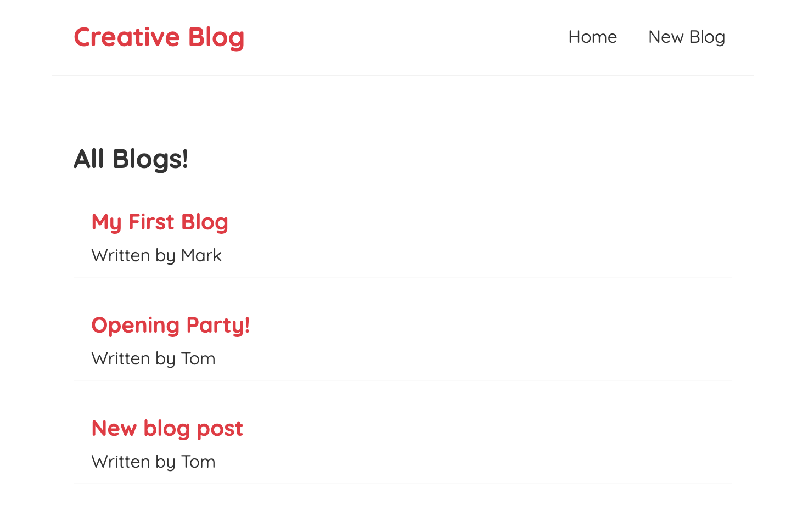

# React Blog

> A mini blog, where you can list different articles, you can delete articles and add new articles to the home page. I used React because I wanted to learn more about the fundamentals like the setup, JSX templates, components & events. And I also wanted to cover state & the use of hooks and React Router.

## Table of contents

- [General info](#general-info)
- [Screenshots](#screenshots)
- [Technologies](#technologies)
- [Setup](#setup)
- [Features](#features)
- [Status](#status)
- [Inspiration](#inspiration)
- [Contact](#contact)

## General info

To learn about components, templates, state, props, react router, how to fetch data and how to use react hooks like useState, useEffect and also make a custom hook called useFetch.

## Screenshots

Below is what you should see when you run the project.

## Technologies

- HTML5
- CSS3
- JavaScript
- React - 17.0.2
- JSON Server

## Setup

This project was bootstrapped with [Create React App](https://github.com/facebook/create-react-app).

In the project directory, you can run:

### `npx json-server --watch data/db.json --port 8000`

Load data/db,json file. This is our JSON server for our blogs data.

### `npm start`

Runs the app in the development mode.\
Open [http://localhost:3000](http://localhost:3000) to view it in the browser.

The page will reload if you make edits.\
You will also see any lint errors in the console.

### `npm test`

Launches the test runner in the interactive watch mode.
See the section about running tests for more information.

## Features

List of features ready

- Preview a list of blogs in the Homepage, showing titles and author.
- Create a new blog post and make a post request to json server to add that data to our data file.
- Delete existing posts and redirect the user back to the Homepage.

To-do list:

- Add post date and time
- Add an image field to the form
- A way to update exisiting posts

## Status

Project is: _in progress_ I am hoping to add new features to this project in the future.

## Inspiration

Credit @iamshaunjp. Project based on studying [Full Modern React Tutorial](https://github.com/iamshaunjp/Complete-React-Tutorial)

## Contact

Created by [@Max88-git](mlockwood@hotmail.co.uk/) - feel free to contact me!
